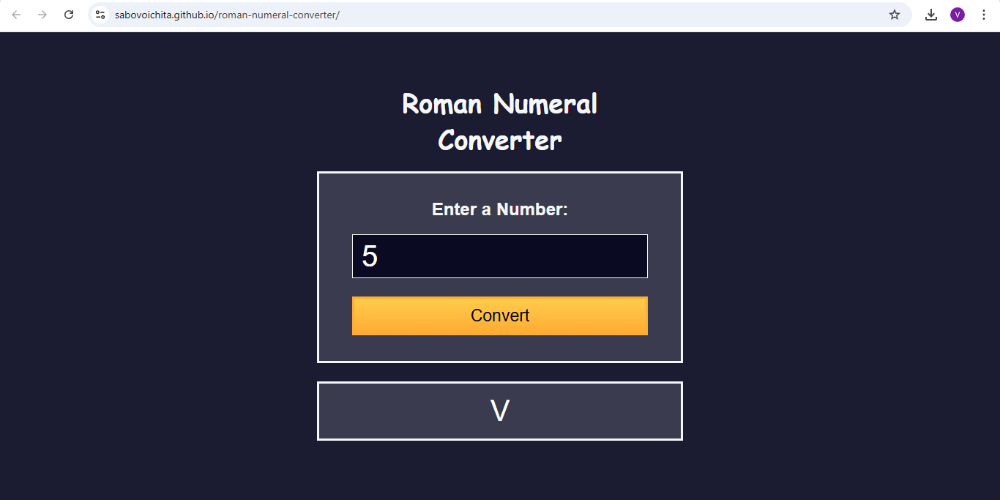

# Roman Numeral Converter

Build a Roman Numeral Converter
Roman numerals are based on seven symbols and can be written using various combinations to represent Arabic numerals.

# [live](https://sabovoichita.github.io/roman-numeral-converter/)

